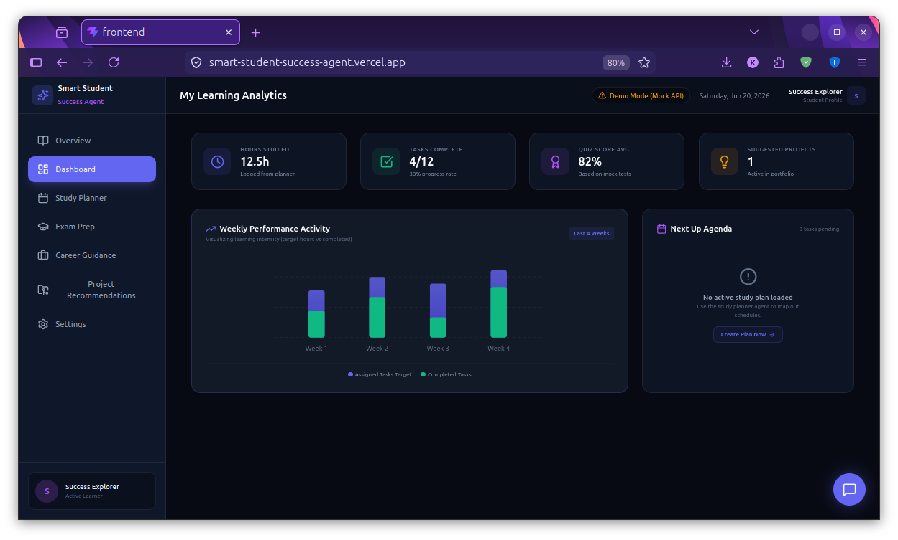
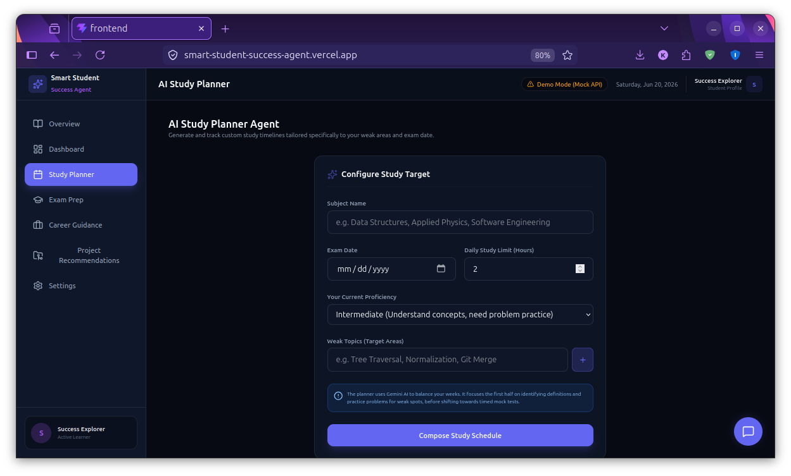
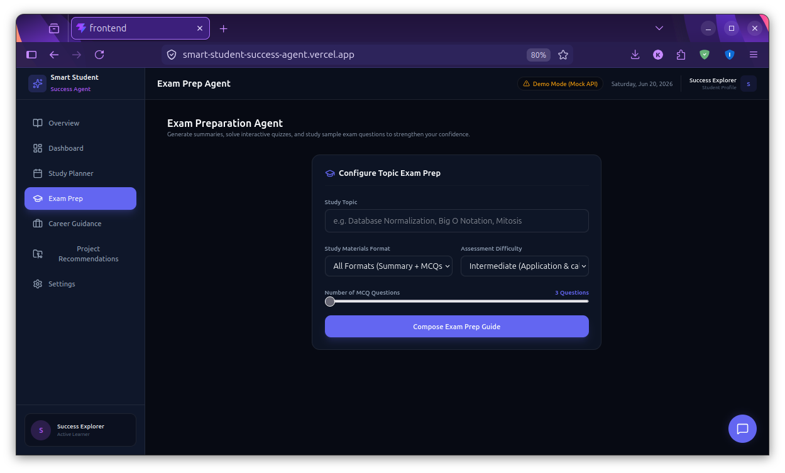
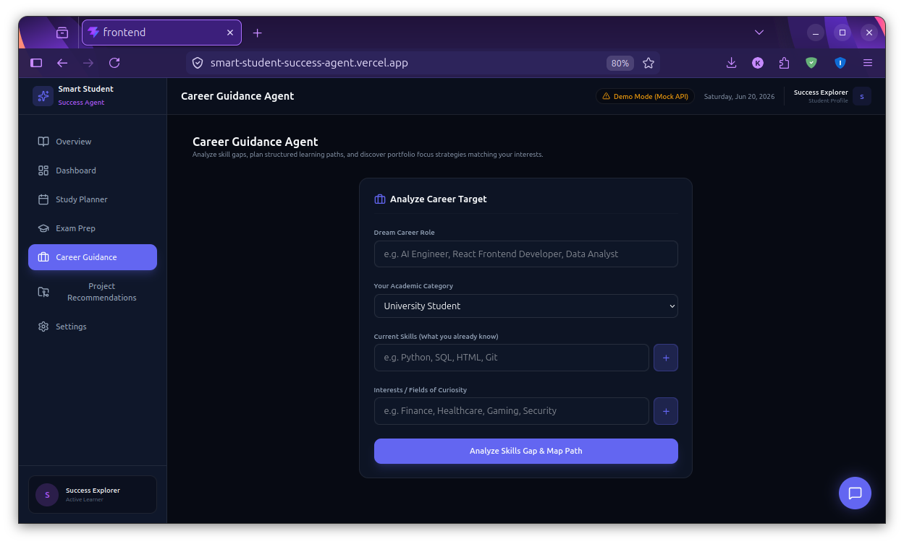

# Smart Student Success Agent 🎓🤖

### Kaggle Capstone Project: "AI Agents: Intensive Vibe Coding"

**Category:** Agents for Good  
**Focus Area:** Education Technology (EdTech)

[](#)
[](#)
[](#)
[](#)

---

## 🌐 Live Demo

👉 [Explore the Smart Student Success Agent](https://smart-student-success-agent.vercel.app)

## 📂 GitHub Repository

👉 [View Source on GitHub](https://github.com/Kashif-Mustari/Smart-Student-Success-Agent)

---

## 🎯 Problem Statement

Many students struggle with study planning, exam preparation, and career direction due to the lack of personalized academic guidance, leading to overwhelming stress and sub-optimal career preparation.

## 💡 Solution

Smart Student Success Agent is an AI-powered academic mentor that empowers students to generate personalized study schedules, prepare for exams, analyze skill gaps, explore career paths, and discover portfolio projects through specialized, cooperative AI agents.

---

## 📸 Screenshots

### Dashboard


### Study Planner


### Exam Preparation


### Career Guidance


---

## 🏆 Capstone Highlights

This project was developed as part of the **Google × Kaggle "AI Agents: Intensive Vibe Coding"** program to demonstrate how multi-agent architectures can solve critical real-world educational challenges.

* **AI Study Planner Agent** for custom timeline scheduling.
* **Exam Preparation Agent** for conceptual dynamic quizzing.
* **Career Guidance Agent** for industry skill gap analysis.
* **Project Recommendation Agent** with dynamic GitHub template outputs.
* **Progress Tracking Dashboard** built with responsive data visualizations.
* **AI Academic Chatbot Assistant** acting as a persistent, context-aware sidekick.
* **Gemini 2.5 Flash Integration** using the modern `google-genai` structural JSON schemas.
* **Full-Stack Decoupled Architecture** leveraging FastAPI and React.

---

## 🛠️ Tech Stack

| Category | Technology |
|-----------|------------|
| **Frontend** | React, Vite, Tailwind CSS v4, Lucide Icons |
| **Backend** | FastAPI, Python |
| **AI Model** | Gemini 2.5 Flash (via `google-genai` SDK) |
| **Validation** | Pydantic |
| **Testing** | Pytest |
| **Deployment** | Vercel (Frontend), Render (Backend) |
| **Version Control** | Git & GitHub |

---

## 🏗️ System Architecture

The application utilizes a clean, modern decoupled client-server architecture:

1. **Frontend**: React (Vite) styled with **Tailwind CSS v4** and **Lucide Icons** implementing a premium, glassmorphism-based dark theme dashboard.
2. **Backend**: FastAPI (Python) hosting asynchronous REST endpoints and orchestrating individual LLM agent prompts.
3. **AI Reasoning**: Dynamic, structured prompt engineering powered by **Gemini 2.5 Flash** to enforce strict JSON schemas matching frontend UI requirements natively.

### Repository Directory Tree

```text
Smart Student Success Agent
 ├── backend/                   # FastAPI Python Server
 │   ├── app/
 │   │   ├── agents/          # Agent Logic (Planner, Exam Prep, Career, Projects)
 │   │   ├── main.py          # FastAPI Entry & Endpoints
 │   │   ├── models.py        # Pydantic Schemas for Structured JSON
 │   │   └── config.py        # Environment Configuration
 │   ├── tests/                # Automated Pytest suite
 │   └── requirements.txt      # Python dependencies
 └── frontend/                  # React Vite Client
     ├── src/
     │   ├── components/      # Sidebar, Header, ChatBot Shells
     │   ├── pages/           # Dashboard, Planner, Quizzes, Career, Settings
     │   ├── services/        # api.js Client with Offline Mock Fallback
     │   └── index.css        # Tailwind v4 configuration and custom keyframes
     ├── vite.config.js        # Vite + Tailwind v4 plugin config
     └── package.json          # Node dependencies
```

---

## 🌟 Key Features

### 1. AI Study Planner Agent
* **Personalized Timelines**: Generates daily checklists distributed over weeks leading up to your exams.
* **Proficiency Scaling**: Tailors schedules depending on whether you choose `Beginner`, `Intermediate`, or `Advanced` familiarity.
* **Weak Topics Prioritization**: Shifts heavier study weight and priority tracking onto topics you flag as weak.
* **Progress Persistency**: Saves checked-off tasks locally in your browser to maintain real-time completion analytics.

### 2. Exam Preparation Agent
* **Conceptual Summaries**: Outlines custom study topics using clean, markdown-rendered study guides.
* **Interactive MCQs**: Evaluates knowledge via dynamically generated multiple-choice tests featuring real-time visual feedback and deep reasoning explanations.
* **Revision Checklists**: Creates highly structured actionable items for the hours leading up to exam day.

### 3. Career Guidance Agent
* **Skills Gap Analysis**: Map current proficiencies against modern engineering profiles (e.g., *AI Engineer*, *Backend Developer*) to reveal what you need to learn next.
* **Interactive Roadmaps**: Generates horizontal/vertical timelines tracking durations, milestone tech stacks, and direct documentation resources.
* **Portfolio Strategy**: Recommends targeted, high-impact projects designed to help applications pop on recruiters' desks.

### 4. Project Recommendation Agent
* **Portfolio Briefs**: Suggests modular coding blueprints fitting specified language stacks and current capabilities.
* **README Template Generator**: Renders copy-ready GitHub documentation in an interactive terminal workspace equipped with a 1-click clipboard utility.

### 5. Progress Tracking Dashboard
* **Sleek Analytics**: High-level statistical cards tracking total study metrics, quiz score trends, and active portfolio developments.
* **SVG Visualizations**: Fully responsive charts indicating assigned daily targets against actual checked tasks across rolling 4-week spans.

### 6. AI Academic Chatbot Assistant
* **Context-Aware Assistance**: Persistent side-docked chatbot across all routes maintaining active state memory of your setup profile.
* **Helpful Shortcuts**: Auto-suggests interactive query chips enabling fast, single-tap follow-up question digging.

---

## 🚀 Getting Started

### Prerequisites
* **Python**: `python3.10` or higher
* **Node.js**: `node18` or higher
* **Package Management**: `uv` (recommended for speed) or standard `pip`, and `npm`

---

### 1. Backend Setup

1. Change directory to the backend folder:
   ```bash
   cd backend
   ```
2. Set up and activate a clean virtual environment:
   ```bash
   # Using uv (highly recommended)
   uv venv
   source .venv/bin/activate
   
   # Using standard python
   python -m venv venv
   source venv/bin/activate
   ```
3. Install the required Python environments:
   ```bash
   # Using uv
   uv pip install -r requirements.txt
   
   # Using pip
   pip install -r requirements.txt
   ```
4. Configure your environmental credentials:
   ```bash
   cp .env.example .env
   ```
   Open `.env` and configure your API key access:
   ```env
   GEMINI_API_KEY=your_gemini_api_key_here
   ```
5. Spin up the FastAPI local development server:
   ```bash
   uvicorn app.main:app --reload --port 8000
   ```
   The backend logic will open live at `http://localhost:8000`. Interact with structural endpoints via the Swagger ecosystem at `http://localhost:8000/docs`.

---

### 2. Frontend Setup

1. Head into the frontend architecture directory:
   ```bash
   cd frontend
   ```
2. Seed the node infrastructure modules:
   ```bash
   npm install
   ```
3. Launch your local Vite client application workspace:
   ```bash
   npm run dev
   ```
   Open up `http://localhost:5173` inside your modern web browser to interact with your agent network locally.

---

## 🧪 Running Automated Tests

A comprehensive integration test suite is included in the backend repository layer to ensure model formatting adheres flawlessly to incoming JSON payloads.

Execute tests via:
```bash
cd backend
PYTHONPATH=. uv run pytest
```

---

## 🌍 Cloud Production Deployment Guide

### Backend Deployment (Render / Engine)
1. Push your updated code structure out to a private/public GitHub repository.
2. Enter your [Render Management Console](https://render.com/) dashboard and construct a new **Web Service**.
3. Link your designated code repository and pick the **Python** stack.
4. Input the following **Build Command**:
   ```bash
   pip install -r requirements.txt
   ```
5. Input the following **Start Command**:
   ```bash
   uvicorn app.main:app --host 0.0.0.0 --port $PORT
   ```
6. Add your secret elements in the **Environment Variables** manager block:
   * `GEMINI_API_KEY` = *[Your Gemini Key Secret]*
   * `ENV` = `production`

### Frontend Deployment (Vercel)
The client layer is pre-optimized for structural deployment to Vercel. Connect your repository to Vercel, and it will auto-detect Vite's build configurations seamlessly.

#### 💡 Demo Mode Support
The application features an integrated **Demo Mode**. If no custom backend server or API key is declared, the frontend seamlessly transitions to local mock-generation engines. This allows evaluators, judges, and users to explore all core analytical capabilities completely client-side without spinning up external cloud server integrations.

---

## 🛡️ Security Features

* **Client-Side Key Encryption**: Dynamic keys provided through the in-app **Settings** module are retained inside client-side `localStorage` wrappers and transferred explicitly over encrypted TLS paths via request headers.
* **Robust Failback Architecture**: If client endpoints fail to reach downstream API endpoints, UI mechanisms gracefully step down to localized high-fidelity contextual data models, guaranteeing zero downtime.